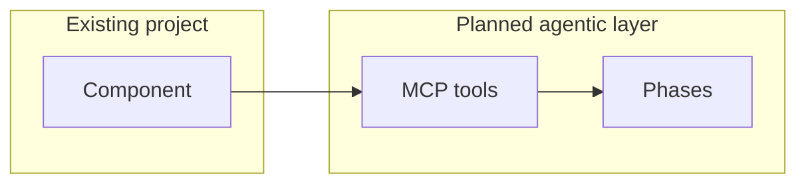

# Architecture planning proposal — Track B

**No implementation in this track** — design and integration planning only.

**Group:**  
**Date:**

## 0. Scope — what are you planning for?

Pick **one**:

- [ ] **My project** — describe below  
- [ ] **Another project** — name, link, or brief description  

**Project name / one-line description:**  

**Why this project:**  

---

## 1. Problem and users

Who uses it today? What pain does an agentic layer address?

---

## 2. Workshop pattern → your project

This hackathon repo uses: **MCP tools** + **Discover → Select → Read → Answer**.

| Workshop component | Exists in your target project? | Your equivalent (or “missing”) |
|--------------------|--------------------------------|--------------------------------|
| PDF / document source | | |
| MCP or tool layer | | |
| Discover (inventory) | | |
| Select (relevance) | | |
| Read (extract / retrieve) | | |
| Answer (report / synthesis) | | |

What would you **reuse** from the workshop architecture? What would you **replace**?

---

## 3. Integration architecture (plan only)

Draw or describe how agentic components connect to the existing system:

**Data flow:** where do documents, queries, and answers enter/exit?

**Deployment:** local, server, HPC, cloud — what fits this project?

---

## 4. MCP tool surface (planned)

Tools you would expose (3–6). No code — names and contracts only.

| Tool | Args | Returns | Maps to workshop tool? |
|------|------|---------|------------------------|
| | | | |

---

## 5. Agent phases (planned)

3–7 steps for your use case. Map to Discover → Select → Read → Answer where helpful.

---

## 6. Human-in-the-loop gates

Where must a scientist approve before the agent continues?

---

## 7. Risks and constraints

Hallucination, licensing, PHI, cost, existing codebase constraints, …

---

## 8. Roadmap (planning horizon)

**Next 2 weeks (spike / design validation):**  

**Next 3 months (if funded / continued):**  

---

## 9. What you are explicitly not doing today

List out-of-scope items so the plan stays realistic (e.g. no production deploy, no new data pipeline, no LLM fine-tuning).
