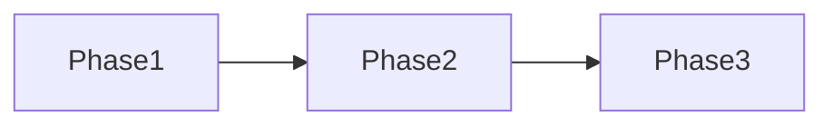

# Agentic tool design proposal

**Group:**  
**Domain / problem:**  

## 1. Problem and users

## 2. Inputs and outputs

| Input | Output |
|-------|--------|

## 3. MCP tool surface

| Tool | Args | Returns |
|------|------|---------|
| | | |

## 4. Agent phases

Map to Discover → Select → Read → Answer (or draw your own):

## 5. Human-in-the-loop gates

Where must a scientist approve?

## 6. Risks

Hallucination, licensing, PHI, cost, …

## 7. Two-week roadmap

**Week 1:**  
**Week 2:**  

## 8. Integrations (optional)

ELN, HPC, Slack, …
